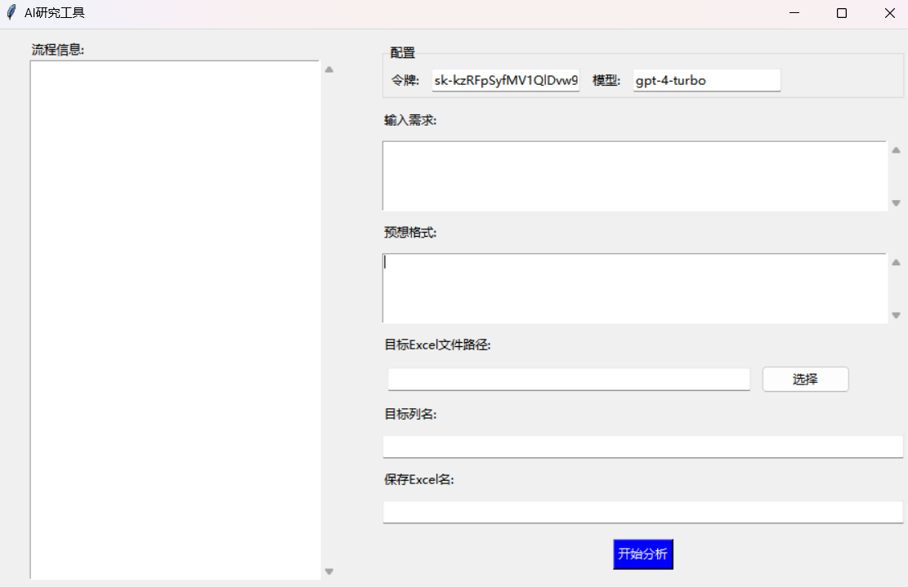

一、项目概述

这是一个将chatgpt用于学术研究的项目，目前主要针对自然语言处理，可做常见的情感分析、主题编码等，也可用于尝试分析多结果，适用于多条评论、多条文本，基于AI理解能力生成分析结果。

二、模块说明

app:软件的直接调用程序

gui:设置用户交互界面、后台运行、打印结果

model:模型的参数设置、获取响应

prompt:提示词构造

store:数据保存

utils:其他工具函数

三、依赖安装

pip install -r requirements.txt

四、gui效果展示

五、使用方法

1、运行app文件

2、输入令牌与模型，详情可参考openai官网

https://platform.openai.com/docs/overview

3、填写需要对语句进行的分析需求，如“进行情感分析”“提取主题”

4、填写保存的格式，如“情感结果”“主题结果”，后续将作为列名保存

5、选择分析的excel与对应的列名，填写保存文件格式，保存文件需为demo.xlsx格式

六、实例效果展示

https://github.com/wz289494/AiResearch/assets/151500660/c8b0ab80-6835-4d82-b34f-d4b4c58f310f
